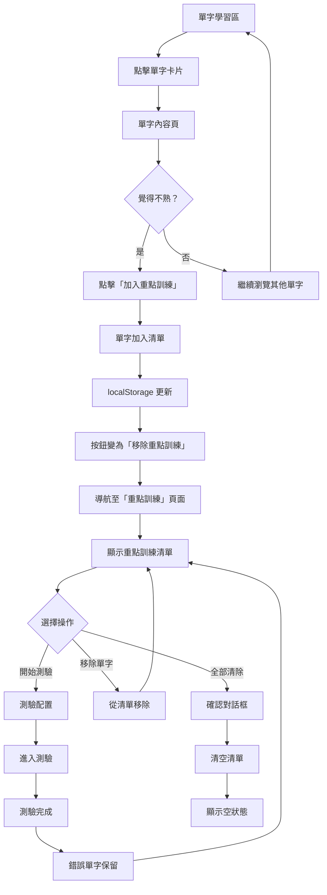
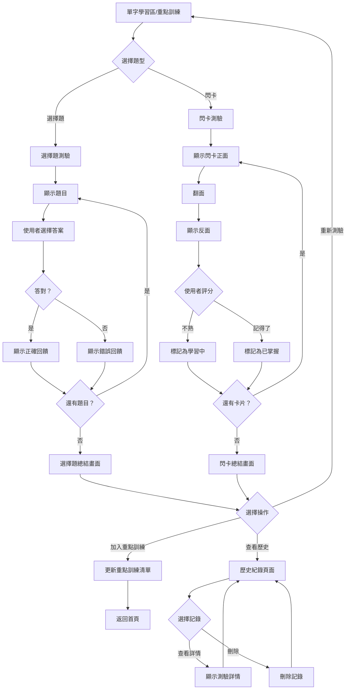
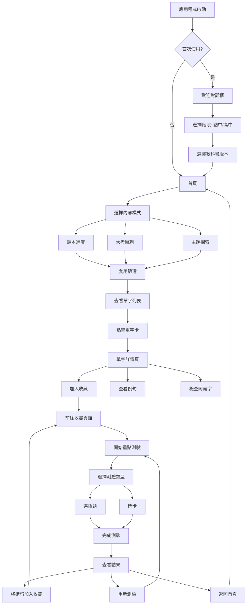
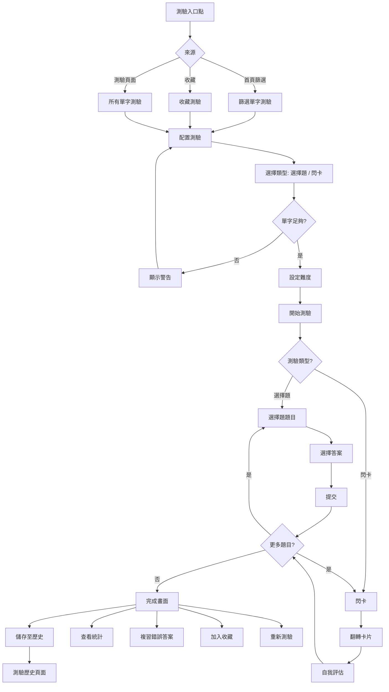
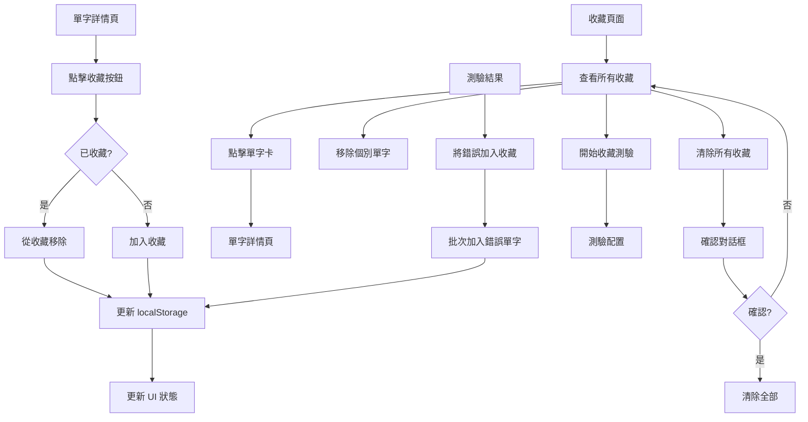

# 產品需求文件 (PRD)
# WordGym Students / 單字健身坊 - 學生版

**版本**: 1.0
**最後更新**: 2025-12-20
**產品類型**: 單頁詞彙學習應用程式
**目標使用者**: 國高中學生 (台灣)

---

## 目錄

1. [產品概覽](#1-產品概覽)
2. [功能規格](#2-功能規格)
3. [使用者流程](#3-使用者流程)
4. [技術架構](#4-技術架構)
5. [資料模型](#5-資料模型)
6. [導航結構](#6-導航結構)
7. [非功能性需求](#7-非功能性需求)
8. [未來改進](#8-未來改進)

---

## 1. 產品概覽

### 1.1 產品願景

WordGym Students 是一個專為台灣國高中學生設計的網頁詞彙學習平台。該平台讓學生能夠瀏覽、學習和評估與課程相符的英語詞彙掌握度。

### 1.2 目標使用者

**主要使用者**:
- 國中生 - 7-9 年級
- 高中生 - 10-12 年級

**使用者特徵**:
- 熟悉行動優先介面
- 需要快速存取與教科書版本相符的詞彙
- 偏好視覺化學習和遊戲化測驗
- 需要可離線使用的學習工具

### 1.3 核心價值主張

1. **課程對齊**: 與台灣主要教科書出版商同步的詞彙
2. **自包含**: 單一 HTML 檔案部署 - 不需要伺服器
3. **離線優先**: 初次資料載入後無需網路即可使用
4. **全方位**: 在一個地方瀏覽、收藏、測驗和追蹤進度
5. **智慧學習**: 針對錯誤和困難單字進行重點訓練

### 1.4 成功指標

- 每次使用時間
- 測驗完成率
- 詞彙保留率 (透過重複測驗表現衡量)
- 收藏集大小
- 回訪使用者比率

---

## 2. 功能規格

### 2.1 首頁 / 單字瀏覽區

#### 2.1.1 首次進入：版本選擇流程

**功能名稱**: 初次版本選擇機制（First-time Version Selection）

**使用者故事**:
- 作為首次使用的學生，我需要選擇我的學程和課本版本，以便看到對應的詞彙內容
- 作為學生，我想要系統記住我的選擇，以便下次進入時不用重新選擇
- 作為學生，我想要能夠更換版本，以便因應轉學或使用不同版本的需求

**功能需求**:

| 需求 ID | 描述 | 優先級 |
|---------|------|--------|
| VS-001 | 首次進入時強制顯示版本選擇對話框 | P0 |
| VS-002 | 學程選擇：高中 / 國中（單選） | P0 |
| VS-003 | 高中版本選擇：龍騰、三民（單選） | P0 |
| VS-004 | 國中版本選擇：康軒、翰林、南一（單選） | P0 |
| VS-005 | 選擇完成後儲存至 localStorage | P0 |
| VS-006 | 下次進入時載入已儲存的版本，不再顯示選擇對話框 | P0 |
| VS-007 | 頁面頂部顯示目前選擇的版本區塊 | P0 |
| VS-008 | 點擊版本區塊可重新開啟版本選擇對話框 | P0 |
| VS-009 | 變更版本後重新載入對應詞彙資料 | P0 |

**版本選擇流程**:

```
首次進入應用程式
    ↓
檢查 localStorage 中是否有版本設定
    ↓
【否】→ 顯示版本選擇對話框
    ├─ 步驟 1：選擇學程（高中/國中）
    ├─ 步驟 2：選擇課本版本
    │   ├─ 若選高中：龍騰 / 三民
    │   └─ 若選國中：康軒 / 翰林 / 南一
    ├─ 點擊「確認」按鈕
    ├─ 儲存至 localStorage (wordgym_user_settings_v1)
    └─ 關閉對話框，進入首頁
    ↓
【是】→ 直接進入首頁，頂部顯示版本資訊
    ↓
使用者點擊頂部版本區塊
    ↓
重新開啟版本選擇對話框（可重新選擇）
    ↓
確認後更新 localStorage 並重新載入資料
```

**UI/UX 需求**:
- 對話框採用 Modal 形式，帶半透明背景遮罩
- 學程選擇使用大型按鈕（高中/國中），清晰易點
- 版本選擇使用卡片式設計，顯示出版社 Logo（未來可加入）
- 頂部版本區塊採用 Chip/Badge 設計，顯示「國中-康軒」或「高中-龍騰」
- 版本區塊需有視覺提示（如 icon）表示可點擊
- 變更版本時顯示載入動畫

**資料需求**:
- 儲存在 localStorage (鍵值: `wordgym_user_settings_v1`)
- UserSettings 介面需包含 `stage` (國中/高中) 和 `version` (出版社)
- 版本變更時需觸發詞彙資料重新載入

---

#### 2.1.2 三大主題詳細規格

**功能名稱**: 三大學習主題篩選系統（課本進度 / 大考衝刺 / 主題探索）

**使用者故事**:
- 作為學生，我想要選擇我的教育階段 (國中/高中)，以便看到相關詞彙
- 作為學生，我想要選擇內容模式 (課本/考試/主題)，以便學習目標詞彙
- 作為學生，我想要用關鍵字搜尋，以便快速找到特定單字
- 作為學生，我想要看到詞彙列表，以便瀏覽和選擇要學習的單字
- 作為學生，我想要透過詞性快速篩選單字，以便專注於特定詞性的學習

**功能需求**:

| 需求 ID | 描述 | 優先級 |
|---------|------|--------|
| BR-001 | 階段選擇: 國中 / 高中 | P0 |
| BR-002 | 內容模式選擇: 課本進度 / 大考衝刺 / 主題探索 | P0 |
| BR-003 | 即時過濾的關鍵字搜尋 | P0 |
| BR-004 | 顯示單字列表，包含: 英文單字、中文定義、詞性標籤 | P0 |
| BR-005 | 第二層詞性快篩 (名詞、動詞、形容詞、副詞、其他) | P0 |
| BR-006 | 依 CEFR 等級篩選 (A1-C2) | P2 |
| BR-007 | 在 localStorage 中保留使用者篩選選擇 | P1 |
| BR-008 | 篩選完成後顯示「開始測驗」按鈕 | P0 |

---

**主題一：課本進度（Textbook Progress）**

**高中模式篩選條件**:

**第一層篩選**:
- **冊次選擇**（單選）：
  - 第一冊、第二冊、第三冊、第四冊、第五冊、第六冊
  - 顯示方式：Dropdown 或 Chip 群組
  - 預設：無選擇（顯示「請選擇冊次」）

- **課次選擇**（可複選）：
  - 依據所選冊次動態載入課次列表
  - 例如：L1, L2, L3... L10
  - 顯示方式：Checkbox 群組
  - 預設：無選擇（顯示「請選擇課次」）

**篩選後行為**:
- 選擇冊次 + 至少一個課次後，顯示對應單字列表
- 單字列表顯示：英文單字、中文定義、詞性標籤
- 自動顯示第二層「詞性快篩」選項

**國中模式篩選條件**:

**第一層篩選**:
- **冊次選擇**（單選）：
  - 第一冊、第二冊、第三冊、第四冊、第五冊、第六冊
  - 顯示方式：Dropdown 或 Chip 群組

- **課次選擇**（可複選）：
  - 依據所選冊次動態載入課次列表
  - 例如：L1, L2, L3... L9
  - 顯示方式：Checkbox 群組

**篩選後行為**:
- 與高中模式相同

---

**主題二：大考衝刺（Exam Preparation）**

**高中模式篩選條件**:

**第一層篩選**:
- **歷年學測**（年份選擇）：
  - 年份列表：111 學測、112 學測、113 學測、114 學測...
  - 顯示方式：Chip 群組或 Dropdown
  - 可複選：是（可選擇多個年份）
  - 預設：無選擇（顯示「請選擇年份」）

**篩選後行為**:
- 選擇至少一個年份後，顯示對應考試出現過的單字
- 單字標記該年度考試中的題型/出處（未來功能）

**國中模式篩選條件**:

**第一層篩選**:
- **歷年會考**（年份選擇）：
  - 年份列表：111 會考、112 會考、113 會考、114 會考...
  - 顯示方式：Chip 群組或 Dropdown
  - 可複選：是
  - 預設：無選擇

**篩選後行為**:
- 與高中模式相同

---

**主題三：主題探索（Theme Exploration）**

**高中模式篩選條件**:

**第一層篩選**:
- **Level 選擇**（單選）：
  - Level L1、Level L2、Level L3、Level L4、Level L5、Level L6
  - 顯示方式：Chip 群組
  - 說明：Level 代表單字難度等級

- **主題選擇**（單選或複選）：
  - 依據 Level 動態載入對應主題
  - 主題範例：
    - Daily Life (日常生活)
    - School (學校)
    - Food (食物)
    - Sports (運動)
    - Travel (旅遊)
    - Technology (科技)
  - 顯示方式：Card Grid 或 List

**篩選後行為**:
- 選擇 Level + 主題後，顯示對應單字列表
- 顯示主題相關的學習建議（未來功能）

**國中模式篩選條件**:

**第一層篩選**:
- **單字範圍選擇**（單選）：
  - 1200 單
  - 800 單
  - 顯示方式：大型按鈕或 Chip

- **主題選擇**（可選，可複選）：
  - 不依賴範圍選擇，可直接選主題
  - 主題範例：
    - 日常生活
    - 學校課業
    - 家庭朋友
    - 飲食健康
    - 休閒娛樂

**篩選後行為**:
- 選擇範圍後，顯示所有該範圍內的單字
- 若有選主題，則進一步篩選至該主題的單字

---

**第二層：詞性快篩（POS Quick Filter）**

**觸發條件**:
- 第一層篩選完成後，自動顯示詞性快篩選項

**功能需求**:

| 需求 ID | 描述 | 優先級 |
|---------|------|--------|
| POS-001 | 預設顯示全部單字（無篩選） | P0 |
| POS-002 | 提供詞性選項：名詞、動詞、形容詞、副詞、其他 | P0 |
| POS-003 | 單選模式：點擊某詞性，僅顯示該詞性的單字 | P0 |
| POS-004 | 可切換回「全部」以取消詞性篩選 | P0 |
| POS-005 | 詞性篩選狀態即時反映在單字列表 | P0 |
| POS-006 | 詞性選項旁顯示該詞性的單字數量（如：名詞 (45)） | P1 |

**詞性選項**:
- 全部（預設）
- 名詞 (Noun)
- 動詞 (Verb)
- 形容詞 (Adjective)
- 副詞 (Adverb)
- 其他（介系詞、連接詞、感嘆詞等）

**UI/UX 設計**:
- 顯示方式：水平 Chip 群組，固定在單字列表上方
- 選中狀態：高亮顯示（如：背景色變更、邊框加粗）
- 位置：在單字列表與第一層篩選器之間
- 響應式：行動版可左右滑動

**篩選後行為**:
- 單字列表即時更新
- 若篩選後無單字，顯示空狀態：「目前選擇的條件下無符合的單字」

---

**「開始測驗」按鈕**

**觸發條件**:
- 第一層篩選完成且有單字顯示時，顯示「開始測驗」按鈕

**功能需求**:

| 需求 ID | 描述 | 優先級 |
|---------|------|--------|
| QS-001 | 篩選後顯示「開始測驗」浮動按鈕（FAB） | P0 |
| QS-002 | 點擊後跳轉至測驗配置頁面 | P0 |
| QS-003 | 自動帶入目前篩選的單字列表作為測驗範圍 | P0 |
| QS-004 | 若單字數量不足（< 4），顯示提示「單字數量不足，無法開始測驗」 | P0 |

**UI/UX 設計**:
- 按鈕樣式：Primary CTA 按鈕，顏色醒目
- 位置：固定在右下角（FAB），或在單字列表上方
- 文字：「開始測驗 (25 單字)」- 顯示當前單字數量
- 狀態：
  - 啟用：單字數量 >= 4
  - 禁用（灰色）：單字數量 < 4

---

**UI/UX 整體需求**:
- 行動優先響應式設計
- 基於標籤的模式切換（三大主題）
- 清晰的篩選群組視覺層次
- 具有 hover/點擊互動的單字卡
- 大量單字列表的分頁或無限滾動
- 資料獲取期間的載入狀態
- 具有有用訊息的空狀態

**資料需求**:
- 應用程式初始化時從 Google Sheets 載入詞彙
- 快取在 localStorage (鍵值: `mvp_vocab_dataset_v36`)
- 保留篩選狀態 (鍵值: `wordgym_filters_v1`, `wordgym_current_tab_v1`)
- 詞性快篩狀態 (鍵值: `wordgym_quick_filter_pos_v1`)

---

#### 2.1.3 單字內容畫面（Vocabulary Detail Page）完整規格

**頁面名稱**: 單字內容頁（Vocabulary Detail Page）

**用途**: 讓學習者理解一個單字的所有學習資訊，並能進一步擴充例句、關聯詞與練習

**使用者故事**:
- 作為學生，我想要查看單字的詳細資訊，以便徹底學習
- 作為學生，我想要聽發音，以便學習正確發音
- 作為學生，我想要看例句，以便理解上下文
- 作為學生，我想要新增/移除重點訓練（收藏），以便建立我的學習列表
- 作為學生，我想要看到關聯字彙並能快速跳轉，以便擴充學習
- 作為老師，我想要匯出教學資料，以便製作教材
- 作為學生，我想要看到詞性變化，以便完整掌握單字用法

---

**頁面結構（7 大區塊）**:

---

**1️⃣ Header 區塊（頁首）**

**功能**: 導航與行為入口

**元件**:

| 元件名稱 | 功能描述 | 優先級 |
|---------|---------|--------|
| 返回按鈕（←） | 返回上一層（單字列表/收藏列表/測驗頁面） | P0 |
| 加入重點訓練按鈕（CTA） | 將此單字加入個人重點訓練（收藏） | P0 |
| 移除重點訓練按鈕 | 若已加入，顯示「移除重點訓練」 | P0 |

**功能需求**:

| 需求 ID | 描述 | 優先級 |
|---------|------|--------|
| VD-H-001 | 顯示返回按鈕，點擊返回上一頁 | P0 |
| VD-H-002 | 顯示「加入重點訓練」按鈕（Primary CTA） | P0 |
| VD-H-003 | 若已加入收藏，按鈕文字改為「移除重點訓練」 | P0 |
| VD-H-004 | 點擊按鈕即時更新 localStorage 收藏狀態 | P0 |
| VD-H-005 | 按鈕狀態即時反映在 UI 上（視覺回饋） | P0 |

**UI/UX 需求**:
- CTA 按鈕採用 Primary 樣式，顏色醒目
- 已加入狀態使用不同顏色（如：綠色→紅色）
- 返回按鈕位於左上角
- CTA 按鈕位於右上角或固定在頁面頂部

---

**2️⃣ 單字主資訊區（Word Hero Section）**

**功能**: 顯示單字核心學習資訊

**顯示內容**:

| 資訊項目 | 範例 | 優先級 |
|---------|------|--------|
| 英文單字 | access | P0 |
| 音標 | /ˈæk.ses/ | P0 |
| 詞性 | n. / v. | P0 |
| 中文釋義 | 接近、使用權 | P0 |
| 難度標籤 | CEFR 等級（B1）、Level（L4） | P1 |
| 類型標籤 | 課本、考試、主題 | P1 |

**互動功能**:

| 功能 | 描述 | 優先級 |
|------|------|--------|
| 發音按鈕 | 點擊播放標準發音（TTS 或音檔） | P0 |
| 美音/英音切換 | 未來功能：切換發音版本 | P2 |

**功能需求**:

| 需求 ID | 描述 | 優先級 |
|---------|------|--------|
| VD-WH-001 | 顯示英文單字（大字體、醒目） | P0 |
| VD-WH-002 | 顯示 KK 音標或 IPA 音標 | P0 |
| VD-WH-003 | 顯示詞性（可能有多個詞性） | P0 |
| VD-WH-004 | 顯示中文釋義 | P0 |
| VD-WH-005 | 顯示難度標籤（CEFR、Level） | P1 |
| VD-WH-006 | 顯示發音按鈕，點擊播放發音 | P0 |
| VD-WH-007 | 發音播放時顯示視覺回饋（如：音波動畫） | P1 |

**UI/UX 需求**:
- 單字主資訊區採用 Hero Section 設計，視覺突出
- 單字字體大、粗體、置中
- 音標、詞性、釋義分層顯示
- 發音按鈕使用 icon（如：🔊）
- 難度標籤使用 Chip/Badge 設計

---

**3️⃣ 例句區（Examples）**

**功能**: 提供上下文學習

**結構**: 每一則例句為一個 Example Card

**單則例句內容**:

| 項目 | 描述 | 優先級 |
|------|------|--------|
| 英文例句 | Highlight 目標單字 | P0 |
| 中文翻譯 | 例句的中文翻譯 | P0 |
| 發音按鈕 | 播放該句語音（TTS） | P1 |
| 出處註記 | 標示例句來源（教材/相關文章） | P2 |

**操作功能**:

| 功能 | 描述 | 優先級 |
|------|------|--------|
| 新增例句（未來功能） | 老師/編輯者可新增例句 | P2 |
| AI 產生例句（未來功能） | 自動產生符合年級的例句 | P2 |

**功能需求**:

| 需求 ID | 描述 | 優先級 |
|---------|------|--------|
| VD-EX-001 | 顯示至少 1 則例句（若資料中有） | P0 |
| VD-EX-002 | 例句中的目標單字需高亮顯示 | P0 |
| VD-EX-003 | 顯示例句的中文翻譯 | P0 |
| VD-EX-004 | 提供發音按鈕，播放例句語音 | P1 |
| VD-EX-005 | 顯示例句出處（如：龍騰第一冊 L3） | P2 |
| VD-EX-006 | 支援展開/收合（例句多時） | P1 |
| VD-EX-007 | Lazy load（例句超過 5 則時） | P2 |

**UI/UX 需求**:
- 例句列表採用卡片式設計
- 目標單字使用粗體或底色高亮
- 發音按鈕位於例句右側
- 多則例句時，使用可展開/收合的 Accordion

---

**4️⃣ 詞性與變化區（Word Forms）**

**功能**: 顯示單字的詞性變化

**顯示內容**: 以標籤/Chip 方式呈現

**詞性變化**:

| 詞性 | 變化型 | 範例 |
|------|--------|------|
| 動詞 | 過去式 | accessed |
| 動詞 | 過去分詞 | accessed |
| 動詞 | 現在分詞 | accessing |
| 動詞 | 第三人稱單數 | accesses |
| 名詞 | 複數形 | accesses |
| 名詞 | 可數/不可數 | 標示屬性 |

**功能需求**:

| 需求 ID | 描述 | 優先級 |
|---------|------|--------|
| VD-WF-001 | 顯示動詞變化（過去式、過去分詞、現在分詞、第三人稱單數） | P1 |
| VD-WF-002 | 顯示名詞變化（複數形、可數/不可數） | P1 |
| VD-WF-003 | 使用 Chip/Badge 形式顯示 | P1 |
| VD-WF-004 | 點擊變化型可切換對應例句（進階功能） | P2 |

**UI/UX 需求**:
- 詞性變化採用 Chip 群組顯示
- 每個變化型為一個小標籤
- 標籤顏色區分不同類型（如：動詞變化藍色、名詞變化綠色）

---

**5️⃣ 關聯字彙區（Relations）**

**功能**: 顯示同義字、反義字、易混淆字

**類型**:

| 關聯類型 | 範例 | 優先級 |
|---------|------|--------|
| 同義字 | approach | P1 |
| 反義字 | deny | P1 |
| 易混淆字 | excess（標示差異原因） | P2 |

**功能需求**:

| 需求 ID | 描述 | 優先級 |
|---------|------|--------|
| VD-RL-001 | 顯示同義字列表 | P1 |
| VD-RL-002 | 顯示反義字列表 | P1 |
| VD-RL-003 | 顯示易混淆字列表 | P2 |
| VD-RL-004 | 點擊關聯字跳轉至該單字詳情頁 | P1 |
| VD-RL-005 | 易混淆字需附「差異提示」（Tooltip/Modal） | P2 |

**UI/UX 需求**:
- 關聯字採用可點擊的 Chip 或 Link
- 點擊後跳轉至該單字的詳情頁
- 易混淆字顯示差異提示（Hover 或點擊顯示）

---

**6️⃣ 匯出/教學使用區（Export & Teaching）**

**功能**: 提供教學資料匯出（未來功能，為老師使用）

**功能選項**:

| 選項 | 描述 | 優先級 |
|------|------|--------|
| 詞性變化 | 匯出時包含詞性變化 | P2 |
| 同義/反義/易混淆 | 匯出時包含關聯字彙 | P2 |
| 字根字首字尾 | 匯出時包含字綴分解 | P2 |

**行為**:

| 功能 | 描述 | 優先級 |
|------|------|--------|
| 匯出成 Markdown | 匯出成 .md 檔案 | P2 |
| 複製到剪貼簿 | 可直接貼到 Google 文件/投影片 | P2 |

**功能需求**:

| 需求 ID | 描述 | 優先級 |
|---------|------|--------|
| VD-EX-001 | 提供 Checkbox 選擇匯出內容 | P2 |
| VD-EX-002 | 匯出成 Markdown 格式 | P2 |
| VD-EX-003 | 提供「複製到剪貼簿」功能 | P2 |

**UI/UX 需求**:
- 匯出區採用可折疊的區塊
- Checkbox 清晰排列
- 匯出按鈕使用 Secondary CTA 樣式

---

**7️⃣ Footer / 編輯入口（未來功能）**

**功能**: 提供編輯入口（權限控管）

**元件**:

| 元件 | 功能 | 優先級 |
|------|------|--------|
| 浮動編輯按鈕（FAB） | 編輯本單字資料 | P2 |

**功能需求**:

| 需求 ID | 描述 | 優先級 |
|---------|------|--------|
| VD-FT-001 | 提供浮動編輯按鈕（FAB） | P2 |
| VD-FT-002 | 點擊後進入編輯模式 | P2 |
| VD-FT-003 | 編輯功能需權限控管（老師/管理者） | P2 |

**權限與狀態說明表**:

| 角色 | 可做事項 |
|------|----------|
| 學生 | 查看、播放、加入訓練 |
| 老師 | 新增例句、匯出教材 |
| 編輯者 | 編輯單字、標籤、關聯 |
| 管理者 | 全部 |

---

**AI 延伸功能（未來）**:

| 功能 | 描述 | 優先級 |
|------|------|--------|
| AI 產生例句 | 依年級/主題自動產生例句 | P2 |
| AI 解釋 | 解釋「為什麼這個字用在這裡」 | P2 |
| AI 易混淆比較 | AI 自動比較 access vs excess | P2 |
| 自動出題 | 選擇/克漏字/朗讀題目 | P2 |

---

**資料需求**:
- `VocabularyWord` 介面的單字資料
- 儲存在 localStorage 的使用者例句 (鍵值: `mvp_vocab_user_examples_v1`)
- 儲存在 localStorage 的收藏 (鍵值: `mvp_vocab_favorites`)
- 權限資料（未來功能，需要使用者角色管理）

**UI/UX 整體需求**:
- 清晰、易讀的排版
- 延伸內容的可展開區段
- 具有單字和收藏按鈕的固定標頭
- 區段間的流暢過渡
- 具有視覺回饋的音訊播放
- 新增使用者例句/筆記的表單
- 導航麵包屑
- 響應式設計（行動優先）

---

**頁面互動流程**:

```
進入單字內容頁
    ↓
【Header】查看單字、點擊「加入重點訓練」
    ↓
【主資訊區】閱讀釋義、播放發音
    ↓
【例句區】查看例句、理解上下文
    ↓
【詞性變化區】學習單字變化
    ↓
【關聯字彙區】點擊同義字/反義字
    ↓
跳轉至關聯單字的詳情頁（迴圈學習）
    ↓
【匯出區】老師匯出教材（未來功能）
    ↓
返回列表或進行測驗
```

---

### 2.2 重點訓練（Focus Training）

#### 📄 頁面名稱
**單字內容頁 × 重點訓練入口**（Vocabulary Detail + Focus Training Entry）

#### 🎯 核心設計目的

**解決的問題：**
- 學生不是每個單字都要練
- 只把「不熟的字」加入重點訓練池
- 集中複習/測驗/強化記憶

**核心價值：**
這頁是「辨識不熟 → 一鍵加入 → 之後集中處理」的關鍵節點

#### 🧭 學習流程位置

```
閱讀 / 任務 / 單字學習
        ↓
   單字內容頁
        ↓
  （覺得不熟）
👉 加入重點訓練
        ↓
   重點訓練區
   - 複習
   - 測驗
   - 移除
```

#### 功能規格

##### 1️⃣ 單字內容頁：加入重點訓練

**功能角色：** 判斷單字熟悉度的入口

**顯示內容：**
- 單字：absolute
- 音標、詞性（adjective）
- 中文解釋
- 難度標籤（Level L4 / B2）
- 例句（含翻譯）

**關鍵 CTA：**
- 按鈕：【加入重點訓練】
- 位置：Header 區塊右上角
- 樣式：Primary Button / Toggle Button

**使用時機：**
學生覺得該單字：
- 看過但記不牢
- 意思模糊
- 常錯

**行為邏輯：**
1. 點擊後：該單字加入「個人重點訓練清單」
2. 按鈕狀態切換：
   - 未加入：「加入重點訓練」（藍色）
   - 已加入：「移除重點訓練」（紅色）
3. 立即同步至 localStorage
4. 顯示 Toast 提示：「已加入重點訓練」/ 「已移除」

**功能需求：**

| ID | 需求描述 | 優先級 |
|---|---|---|
| FT-ADD-001 | 單字詳情頁顯示「加入重點訓練」按鈕 | P0 |
| FT-ADD-002 | 點擊按鈕將 word.id 加入 localStorage ('mvp_vocab_favorites') | P0 |
| FT-ADD-003 | 按鈕狀態根據是否已加入動態切換文字和顏色 | P0 |
| FT-ADD-004 | 顯示操作成功的 Toast 提示訊息 | P1 |
| FT-ADD-005 | 支援鍵盤快捷鍵（如 F 鍵）快速加入/移除 | P2 |

---

##### 2️⃣ 重點訓練頁面（Focus Training Page）

**頁面路由：** `#/favorites`

**區塊名稱：** 重點訓練池（Focus Training Pool）

**顯示內容：**

1. **Header 區塊：**
   - 標題：「重點訓練 (數量)」
   - 說明文字：「點擊重點訓練，可以在這邊複習單字，或是進行測驗」

2. **單字卡片列表：**
   - 每個單字顯示為卡片
   - 卡片內容：
     - 單字本身（如：bed / abandon / abstract）
     - 詞性標籤（名詞、動詞、形容詞等）
   - 操作：【移除】按鈕

3. **主要操作按鈕：**
   - 🟣 **開始測驗**
   - ⚪ **全部清除**

**頁面狀態：**

| 狀態 | 顯示內容 |
|---|---|
| 載入中 | Loading spinner + "載入中..." |
| 空狀態（0 個單字） | "尚未加入任何重點訓練單字" + 提示文字 |
| 有單字（1+ 個） | 顯示單字卡片列表 + 操作按鈕 |

**功能需求：**

| ID | 需求描述 | 優先級 |
|---|---|---|
| FT-PAGE-001 | 顯示標題「重點訓練 (數量)」，數量即時更新 | P0 |
| FT-PAGE-002 | 從 localStorage 讀取 favorites，篩選出對應的單字 | P0 |
| FT-PAGE-003 | 顯示單字卡片，包含單字、詞性標籤 | P0 |
| FT-PAGE-004 | 每個卡片有「移除」按鈕，點擊後從清單移除 | P0 |
| FT-PAGE-005 | 顯示「開始測驗」按鈕，點擊後跳轉至測驗頁面 | P0 |
| FT-PAGE-006 | 顯示「全部清除」按鈕，點擊後清空所有重點訓練單字 | P1 |
| FT-PAGE-007 | 全部清除前顯示確認對話框「確定要清除所有重點訓練單字？」 | P1 |
| FT-PAGE-008 | 空狀態顯示友善提示：「在單字學習區，如果有不熟的單字，可以加入重點訓練」 | P1 |
| FT-PAGE-009 | 支援 Loading 狀態，資料載入前顯示 spinner | P0 |
| FT-PAGE-010 | 單字卡片支援點擊跳轉至該單字詳情頁 | P2 |

---

##### 3️⃣ 重點訓練區的主要操作

###### 🟣 開始測驗

**功能：**
- 將目前清單中的單字產生測驗
- 或進入複習模式

**測驗類型（可配置）：**
- 單字 → 中文（Multiple Choice）
- 中文 → 單字（Flashcard）
- 例句填空（克漏字）
- 聽音選字（未來）

**行為邏輯：**
1. 點擊「開始測驗」
2. 檢查重點訓練清單單字數量：
   - < 4 個：顯示警告「至少需要 4 個單字才能開始測驗」
   - ≥ 4 個：跳轉至測驗配置頁面
3. 測驗配置頁面：
   - 選擇測驗模式（選擇題 / 閃卡）
   - 確認後開始測驗
4. 測驗範圍：僅包含重點訓練清單中的單字

**功能需求：**

| ID | 需求描述 | 優先級 |
|---|---|---|
| FT-QUIZ-001 | 「開始測驗」按鈕點擊後檢查單字數量 | P0 |
| FT-QUIZ-002 | 單字數量 < 4 時顯示警告提示 | P0 |
| FT-QUIZ-003 | 跳轉至測驗頁面，自動帶入重點訓練清單 | P0 |
| FT-QUIZ-004 | 測驗完成後，錯誤的單字自動保留在重點訓練清單 | P1 |
| FT-QUIZ-005 | 測驗完成後，正確的單字提示「是否移除？」 | P2 |

###### ⚪ 全部清除

**功能：**
- 清空重點訓練池

**適用情境：**
- 一輪複習完成
- 學生想重新開始
- 測驗全部通過

**行為邏輯：**
1. 點擊「全部清除」
2. 顯示確認對話框：「確定要清除所有重點訓練單字？」
3. 確認後：
   - 清空 localStorage ('mvp_vocab_favorites')
   - 頁面顯示空狀態
   - 顯示 Toast：「已清除所有重點訓練單字」

**功能需求：**

| ID | 需求描述 | 優先級 |
|---|---|---|
| FT-CLEAR-001 | 顯示「全部清除」按鈕 | P1 |
| FT-CLEAR-002 | 點擊後顯示確認對話框 | P1 |
| FT-CLEAR-003 | 確認後清空 localStorage | P1 |
| FT-CLEAR-004 | 清空後顯示空狀態頁面 | P1 |

###### 🔘 單字移除（單筆操作）

**功能：**
- 從重點訓練清單移除單一單字

**使用時機：**
- 單字已熟悉
- 不想再練習

**行為邏輯：**
1. 點擊單字卡片的「移除」按鈕
2. 該單字立即從清單移除
3. localStorage 同步更新
4. 顯示 Toast：「已移除」
5. 數量即時更新

**功能需求：**

| ID | 需求描述 | 優先級 |
|---|---|---|
| FT-REMOVE-001 | 每個單字卡片顯示「移除」按鈕 | P0 |
| FT-REMOVE-002 | 點擊後立即從清單移除該單字 | P0 |
| FT-REMOVE-003 | localStorage 同步更新 | P0 |
| FT-REMOVE-004 | 顯示操作成功提示 | P1 |

---

#### 🔐 權限與對象

| 使用者 | 行為 |
|---|---|
| 學生 | 加入 / 移除 / 測驗 |
| 老師 | （可選）檢視學生重點訓練字 |
| 系統 | 自動記錄熟悉度（未來） |

---

#### 🧠 設計亮點

##### ✅ 1. 把「決定要不要學」交給學生
不是被動背單字，而是**主動標記困難點**

##### ✅ 2. 降低心理負擔
- ❌ 不是「我還有 2000 個單字沒背」
- ✅ 而是「我現在只要處理這 3 個」

##### ✅ 3. 為 AI / 診斷鋪路
這個「重點訓練池」未來可以接：
- 🤖 AI 自動出題（根據錯誤模式）
- 📊 熟悉度曲線（Forgetting Curve）
- 🔄 間隔複習（Spaced Repetition）
- 👨‍🏫 教師儀表板（哪些字最多人卡）
- 📈 學習分析（哪些詞性 / 主題較弱）

---

#### 📊 資料模型

**localStorage Key:**
```
mvp_vocab_favorites: number[]
```

**範例資料：**
```json
[1, 5, 12, 25, 100]
```

**對應 VocabularyWord：**
```typescript
interface VocabularyWord {
  id: number;
  english_word: string;
  chinese_definition: string;
  posTags?: string[];
  // ... other fields
}
```

---

#### 🎨 UI/UX 規格

##### 單字內容頁按鈕樣式

**未加入狀態：**
- 文字：「加入重點訓練」
- 背景色：Indigo-600
- Hover: Indigo-700
- Icon: ➕ (optional)

**已加入狀態：**
- 文字：「移除重點訓練」
- 背景色：Red-500
- Hover: Red-600
- Icon: ✓ (checkmark)

##### 重點訓練頁面佈局

**Header：**
- 返回按鈕（左上）
- 標題：「重點訓練 (3)」（置中或靠左）
- 按鈕區（右上）：「開始測驗」+「全部清除」

**單字卡片：**
- Grid 佈局：
  - Mobile: 1 column
  - Tablet: 2 columns
  - Desktop: 3 columns
- 卡片設計：
  - 白色背景
  - 圓角 12px
  - Shadow on hover
  - 單字（大字體）
  - 詞性標籤（小 chip）
  - 移除按鈕（右下角或卡片底部）

##### 單字卡片視覺設計：左側 Accent 條顏色規則

**設計原則：**
- 使用裝飾性顏色輪換，非語意化設計
- 基於單字 ID 自動分配顏色
- 提供視覺多樣性，避免單調

**顏色配置：**

```typescript
const accentColors = [
  'bg-indigo-500',  // #6366f1 - 靛藍
  'bg-blue-500',    // #3b82f6 - 天藍
  'bg-purple-500',  // #a855f7 - 紫色
  'bg-pink-500',    // #ec4899 - 粉紅
  'bg-green-500'    // #22c55e - 綠色
];
```

**分配邏輯：**

```typescript
// 根據單字 ID 模除 5 來決定顏色
const accentColor = accentColors[word.id % 5] || 'bg-indigo-500';
```

**顏色對應表：**

| 單字 ID % 5 | 顏色類別 | Tailwind Class | Hex Code | 視覺效果 |
|------------|---------|----------------|----------|---------|
| 0 | 靛藍 | bg-indigo-500 | #6366f1 | 深靛藍色 |
| 1 | 天藍 | bg-blue-500 | #3b82f6 | 天空藍 |
| 2 | 紫色 | bg-purple-500 | #a855f7 | 亮紫色 |
| 3 | 粉紅 | bg-pink-500 | #ec4899 | 鮮粉紅 |
| 4 | 綠色 | bg-green-500 | #22c55e | 青綠色 |

**範例：**
- Word ID = 1 → 1 % 5 = 1 → `bg-blue-500` (天藍)
- Word ID = 7 → 7 % 5 = 2 → `bg-purple-500` (紫色)
- Word ID = 10 → 10 % 5 = 0 → `bg-indigo-500` (靛藍)

**UI 實作：**
```tsx
<div className="bg-white rounded-xl shadow-sm border border-gray-200">
  <div className="flex">
    {/* 左側 accent 條 (1px 寬) */}
    <div className={`w-1 ${accentColor}`}></div>

    {/* 卡片內容 */}
    <div className="flex-1 p-2.5">
      <h3>{word.english_word}</h3>
      <p>{word.chinese_definition}</p>
    </div>
  </div>
</div>
```

**設計考量：**

| 考量項目 | 說明 |
|---------|------|
| 為何不使用語意化顏色？ | 簡化實作，避免使用者過度解讀顏色含義 |
| 為何選這 5 種顏色？ | 符合品牌色系，對比度適中，視覺平衡 |
| 如何確保一致性？ | 同一單字的 ID 固定，顏色永遠一致 |
| 色盲友善嗎？ | 顏色僅為裝飾，不影響資訊閱讀 |

**語意化顏色替代方案（未來可考慮）：**

若未來需要語意化顏色，可考慮以下方案：

1. **詞性導向：**
   - 名詞 → 藍色
   - 動詞 → 綠色
   - 形容詞 → 紫色
   - 副詞 → 粉紅色
   - 其他 → 灰色

2. **難度導向：**
   - Level 1-2 → 綠色（簡單）
   - Level 3-4 → 藍色（中等）
   - Level 5-6 → 紫色（困難）
   - Level 7+ → 紅色（進階）

3. **混合方案：**
   - 保留 ID 輪換，加上詞性小標記

**功能需求：**

| ID | 需求描述 | 優先級 |
|----|---------|--------|
| WC-COLOR-001 | 單字卡片左側顯示 1px 寬的 accent 條 | P0 |
| WC-COLOR-002 | 根據 `word.id % 5` 分配顏色 | P0 |
| WC-COLOR-003 | 使用 5 種固定顏色輪換 | P0 |
| WC-COLOR-004 | Fallback 為 `bg-indigo-500` | P1 |
| WC-COLOR-005 | 顏色在所有頁面保持一致（首頁、搜尋結果、重點訓練） | P1 |

---

**空狀態：**
- Icon: 📚 或插圖
- 標題：「尚未加入任何重點訓練單字」
- 副標題：「在單字學習區，如果有不熟的單字，可以加入重點訓練」

---

#### 🔄 互動流程圖



---

### 2.3 實力驗收（Assessment & Review System）

#### 📘 模組名稱
**實力驗收（Assessment & Review System）**

**核心功能：**
- 依「單字學習區的篩選範圍」動態產生測驗
- 支援選擇題 / 閃卡兩種形式
- 與「重點訓練」形成學習閉環

#### 🧭 整體學習流程

```
單字學習區（篩選範圍）
        ↓
     實力驗收
   ┌───────────┐
   │  選擇題   │
   │  閃卡     │
   └───────────┘
        ↓
   即時答對/答錯回饋
        ↓
   測驗完成總結
        ↓
┌───────────────┐
│ 再測一次      │
│ 錯題加入重點訓練 │
└───────────────┘
        ↓
   歷史紀錄（本機）
```

**學習循環：** 標準的「診斷 → 補救 → 再驗收」循環

---

#### 🧩 實力驗收入口規格

##### 來源條件

**測驗範圍來自：**
1. 單字學習區的「目前篩選結果」
2. 或「重點訓練清單」

**使用者可選：**
- 題型：選擇題 / 閃卡
- 題數：系統預設或自訂

**功能需求：**

| ID | 需求描述 | 優先級 |
|---|---|---|
| QUIZ-ENTRY-001 | 從單字學習區進入測驗時，自動帶入當前篩選範圍 | P0 |
| QUIZ-ENTRY-002 | 從重點訓練進入測驗時，自動帶入重點訓練清單 | P0 |
| QUIZ-ENTRY-003 | 測驗配置頁面：選擇題型（選擇題/閃卡） | P0 |
| QUIZ-ENTRY-004 | 顯示題數預覽（根據可用單字數量） | P1 |
| QUIZ-ENTRY-005 | 單字數量 < 4 時顯示警告並禁止開始 | P0 |

---

#### 🟦 題型一：選擇題（Multiple Choice）

##### 1️⃣ 題目來源規格

**題幹生成：**
- 來源：該單字的例句
- 處理：將目標單字替換為「空格」或「______」
- 範例：
  ```
  She found peace ______ the chaos of the city.
  A. amid
  B. among
  C. between
  D. through
  ```

**功能需求：**

| ID | 需求描述 | 優先級 |
|---|---|---|
| MC-STEM-001 | 從單字的 example_sentence 欄位提取例句作為題幹 | P0 |
| MC-STEM-002 | 將目標單字替換為空格（______） | P0 |
| MC-STEM-003 | 顯示例句中文翻譯（可選） | P1 |
| MC-STEM-004 | 若單字無例句，自動排除或使用 AI 生成（未來） | P2 |

##### 2️⃣ 選項生成規則（ABCD）

**正確答案：**
- 該單字本身（正確詞性）

**干擾選項生成邏輯（關鍵設計）：**
從「相同篩選範圍」中：
1. ✅ 相同詞性
2. ✅ 相近用法 / 易混淆
3. 隨機抽取 3 個

**設計亮點：**
- 干擾不是亂選，而是「語意接近但不適合」
- 確保題目有鑑別度

**功能需求：**

| ID | 需求描述 | 優先級 |
|---|---|---|
| MC-OPT-001 | 正確答案為該單字本身 | P0 |
| MC-OPT-002 | 從相同篩選範圍中選取干擾選項 | P0 |
| MC-OPT-003 | 干擾選項必須與正確答案詞性相同 | P0 |
| MC-OPT-004 | 優先選取同義字、反義字、易混淆字作為干擾 | P1 |
| MC-OPT-005 | 若同詞性選項不足 3 個，從全部單字中補足 | P1 |
| MC-OPT-006 | 選項隨機排序（A/B/C/D 位置隨機） | P0 |
| MC-OPT-007 | 確保 4 個選項不重複 | P0 |

##### 3️⃣ 作答狀態（即時回饋）

**選擇答案後：**
1. 鎖定答案（無法更改）
2. 顯示正確/錯誤狀態：
   - ✅ 答對：綠色高亮
   - ❌ 答錯：紅色高亮正確答案
3. 顯示詳細資訊：
   - 正確單字
   - 詞性
   - 中文解釋

**功能需求：**

| ID | 需求描述 | 優先級 |
|---|---|---|
| MC-ANS-001 | 點選選項後立即鎖定，無法更改 | P0 |
| MC-ANS-002 | 答對時綠色高亮使用者選項 | P0 |
| MC-ANS-003 | 答錯時紅色高亮錯誤選項，綠色顯示正確答案 | P0 |
| MC-ANS-004 | 顯示正確答案的詞性和中文解釋 | P0 |
| MC-ANS-005 | 顯示「下一題」按鈕 | P0 |
| MC-ANS-006 | 記錄答題結果到測驗記錄 | P0 |

---

#### 🟥 答錯畫面（錯誤回饋）

**顯示內容：**
1. 題目句子（完整）
2. ✅ 正確答案（高亮顯示）
3. ❌ 使用者答案（標示錯誤）
4. 詞性 + 中文對照
5. （可選）正確答案的例句

**設計重點：**
- 不只說你錯，而是告訴你「錯在哪個語意軸線」
- 幫助理解正確答案的使用情境

**功能需求：**

| ID | 需求描述 | 優先級 |
|---|---|---|
| MC-ERR-001 | 完整顯示題目句子 | P0 |
| MC-ERR-002 | 標示正確答案（綠色）和使用者答案（紅色） | P0 |
| MC-ERR-003 | 顯示正確答案的詞性和中文解釋 | P0 |
| MC-ERR-004 | 顯示正確答案的其他例句（幫助理解） | P1 |
| MC-ERR-005 | 提供「加入重點訓練」按鈕 | P1 |

---

#### 📊 測驗完成總結畫面（Assessment Summary）

##### 統計項目

**顯示內容：**
1. 題目總數
2. 正確題數 / 錯誤題數
3. 正確率（%）
4. 答題時間（可選）

**錯題清單：**
逐題列出：
- 單字
- 題目句
- 正解 vs 使用者答案
- 點擊可查看詳情

**行為選項：**
1. 🔁 **重新測驗**（同範圍）
2. ➕ **將錯題加入重點訓練**
3. 📊 **查看歷史紀錄**

**設計重點：**
- 這一步把 assessment 接回 learning loop
- 錯題自動成為下一輪學習素材

**功能需求：**

| ID | 需求描述 | 優先級 |
|---|---|---|
| MC-SUM-001 | 顯示測驗統計：總題數、正確數、錯誤數 | P0 |
| MC-SUM-002 | 計算並顯示正確率（百分比） | P0 |
| MC-SUM-003 | 顯示答題時間（總時長） | P1 |
| MC-SUM-004 | 列出所有錯題（單字、題目、答案對比） | P0 |
| MC-SUM-005 | 提供「重新測驗」按鈕，使用相同範圍 | P0 |
| MC-SUM-006 | 提供「將錯題加入重點訓練」按鈕 | P0 |
| MC-SUM-007 | 點擊錯題可查看該單字詳情頁 | P1 |
| MC-SUM-008 | 保存測驗記錄至 localStorage | P0 |
| MC-SUM-009 | 返回首頁或單字學習區 | P0 |

---

#### 🟪 題型二：閃卡（Flashcard）

##### 卡片結構

**正面（Recall）：**
- 英文單字（大字體）
- 🔊 發音按鈕

**反面（Recognition）：**
- 詞性
- 中文解釋
- 例句（英文 + 中文）
- （可選）同義字/反義字

**功能需求：**

| ID | 需求描述 | 優先級 |
|---|---|---|
| FC-CARD-001 | 正面顯示英文單字（大字體，置中） | P0 |
| FC-CARD-002 | 提供發音按鈕，點擊播放 TTS | P0 |
| FC-CARD-003 | 點擊卡片或「翻面」按鈕顯示反面 | P0 |
| FC-CARD-004 | 反面顯示詞性、中文解釋、例句 | P0 |
| FC-CARD-005 | 支援左右滑動切換卡片（行動裝置） | P1 |
| FC-CARD-006 | 顯示進度：「第 X / 總數 張」 | P0 |

##### 使用者自評（核心互動）

**評分選項：**
- 🔴 **不熟**（需要再練習）
- 🟢 **我記得了**（已掌握）

**行為邏輯：**

| 操作 | 系統行為 |
|---|---|
| 點擊「不熟」 | 標記為「學習中」，保留在學習佇列 |
| 點擊「我記得了」 | 標記為「已掌握」，移出學習佇列 |

**功能需求：**

| ID | 需求描述 | 優先級 |
|---|---|---|
| FC-EVAL-001 | 反面顯示「不熟」和「我記得了」按鈕 | P0 |
| FC-EVAL-002 | 點擊「不熟」後標記該單字為學習中 | P0 |
| FC-EVAL-003 | 點擊「我記得了」後標記為已掌握 | P0 |
| FC-EVAL-004 | 記錄每張卡片的評分結果 | P0 |
| FC-EVAL-005 | 自動進入下一張卡片 | P0 |
| FC-EVAL-006 | 支援鍵盤快捷鍵（1=不熟，2=記得了） | P2 |

---

#### 🟨 閃卡完成總結畫面

**顯示內容：**
1. 總單字數
2. 已掌握數量
3. 學習中數量（標記為「不熟」）
4. 列出「學習中單字」清單

**操作選項：**
1. ➕ **將學習中單字加入重點訓練**
2. 🔁 **重新測驗**（僅學習中單字）
3. 🏠 **返回首頁**

**功能需求：**

| ID | 需求描述 | 優先級 |
|---|---|---|
| FC-SUM-001 | 顯示總單字數、已掌握、學習中數量 | P0 |
| FC-SUM-002 | 列出所有標記為「學習中」的單字 | P0 |
| FC-SUM-003 | 提供「將學習中單字加入重點訓練」按鈕 | P0 |
| FC-SUM-004 | 提供「重新測驗」按鈕，僅測驗學習中單字 | P0 |
| FC-SUM-005 | 保存測驗記錄至 localStorage | P0 |
| FC-SUM-006 | 顯示進步提示（如：「已掌握 80%！」） | P1 |

---

#### 🕒 歷史紀錄系統（Local-first）

##### 儲存規格

**儲存位置：**
- localStorage
- Key: `mvp_vocab_quiz_history_v1`

**保留策略：**
- 最多保留 **30 筆**
- 超過時自動刪除最舊的記錄

**每筆紀錄內容：**

| 欄位 | 說明 | 範例 |
|---|---|---|
| id | 唯一識別碼 | uuid |
| timestamp | 時間戳記 | 1699999999999 |
| date | 日期時間 | "2024-01-15 14:30" |
| type | 題型 | "multiple-choice" / "flashcard" |
| totalQuestions | 題數 | 20 |
| correct | 正確數 | 16 |
| wrong | 錯誤數 | 4 |
| learning | 學習中（閃卡） | 5 |
| wrongWords | 錯誤單字清單 | [{ wordId, word, correctAnswer, userAnswer }] |
| learningWords | 學習中單字（閃卡） | [{ wordId, word }] |
| score | 分數（百分比） | 80 |
| duration | 答題時間（秒） | 120 |

**功能需求：**

| ID | 需求描述 | 優先級 |
|---|---|---|
| HIST-001 | 每次測驗完成後自動保存記錄至 localStorage | P0 |
| HIST-002 | 最多保留 30 筆，超過時刪除最舊記錄 | P0 |
| HIST-003 | 歷史紀錄頁面顯示所有測驗記錄（時間倒序） | P0 |
| HIST-004 | 每筆記錄顯示：日期、題型、題數、正確率 | P0 |
| HIST-005 | 提供「查看詳情」按鈕，展開該次測驗詳情 | P0 |
| HIST-006 | 提供「刪除」按鈕，使用者可手動刪除單筆記錄 | P1 |
| HIST-007 | 提供「清除所有記錄」按鈕（需確認） | P1 |

---

#### 📋 查看歷史紀錄詳情

**點擊「查看詳情」後顯示：**

##### 作答統計
- 題型（選擇題/閃卡）
- 日期時間
- 總題數
- 正確數 / 錯誤數
- 正確率
- 答題時間

##### 逐題作答情形（選擇題）
- 題號
- 題目（例句）
- 正確答案
- 使用者答案
- ✅ / ❌ 標示

##### 學習中單字列表（閃卡）
- 單字
- 詞性
- 中文解釋
- 點擊可跳轉至單字詳情頁

**功能需求：**

| ID | 需求描述 | 優先級 |
|---|---|---|
| HIST-DTL-001 | 顯示該次測驗的完整統計資訊 | P0 |
| HIST-DTL-002 | 選擇題：顯示每題的答題情況 | P0 |
| HIST-DTL-003 | 閃卡：顯示學習中單字列表 | P0 |
| HIST-DTL-004 | 提供「重新測驗」按鈕（使用相同單字） | P1 |
| HIST-DTL-005 | 單字可點擊跳轉至詳情頁 | P1 |

---

#### 🔄 完整互動流程圖



---

#### 🎨 UI/UX 規格

##### 選擇題畫面

**題目區：**
- 例句（灰色背景卡片）
- 空格以 ______ 顯示
- 中文翻譯（小字體，淺灰色）

**選項區：**
- 4 個選項（A/B/C/D）
- 卡片式設計，可點擊
- Hover 效果：淺藍色背景
- 選中後：
  - 正確：綠色背景 + ✅ icon
  - 錯誤：紅色背景 + ❌ icon
  - 正確答案：綠色邊框高亮

**進度區：**
- 頂部顯示：「第 5 / 20 題」
- 進度條（可選）

##### 閃卡畫面

**卡片設計：**
- 大尺寸卡片（佔據主要視窗）
- 圓角、陰影效果
- 翻轉動畫（3D flip）

**正面：**
- 單字（超大字體，粗體）
- 發音按鈕（右上角）

**反面：**
- 詞性標籤（頂部）
- 中文解釋（中等字體）
- 例句（小字體，引用樣式）
- 評分按鈕（底部，大按鈕）

**導航：**
- 左右箭頭（桌面）
- 滑動手勢（行動裝置）

##### 總結畫面

**統計卡片：**
- 大數字顯示正確率
- 綠色（>80%）/ 黃色（60-80%）/ 紅色（<60%）
- 圓形進度圖（可選）

**錯題清單：**
- 列表式展示
- 可展開查看詳情
- 點擊單字跳轉

**操作按鈕：**
- Primary: 「重新測驗」（藍色）
- Secondary: 「加入重點訓練」（綠色）
- Tertiary: 「返回首頁」（灰色）

---

#### 📊 資料模型

##### QuizRecord Interface

```typescript
interface QuizRecord {
  id: string;
  timestamp: number;
  date: string;
  type: 'multiple-choice' | 'flashcard';
  totalQuestions: number;
  correct: number;
  wrong: number;
  learning: number; // For flashcard
  wrongWords?: Array<{
    wordId: number;
    word: string;
    correctAnswer?: string;
    userAnswer?: string;
    question?: string;
    chinese_definition?: string;
  }>;
  learningWords?: Array<{
    wordId: number;
    word: string;
  }>;
  score: number; // 0-100
  duration?: number; // seconds
}
```

##### localStorage Keys

```
mvp_vocab_quiz_history_v1: QuizRecord[]
```

---

### 2.4 幫助與指引

**功能名稱**: 使用者幫助與引導

**使用者故事**:
- 作為首次使用者，我想要看到歡迎指南，以便理解如何使用應用程式
- 作為學生，我想要存取幫助文件，以便學習最佳實踐
- 作為學生，我想要重置所有資料，以便重新開始

**功能需求**:

| 需求 ID | 描述 | 優先級 |
|---------|------|--------|
| HP-001 | 首次啟動時顯示歡迎對話框 | P0 |
| HP-002 | 在歡迎時收集使用者階段 (國中/高中) | P0 |
| HP-003 | 在歡迎時收集教科書版本 | P0 |
| HP-004 | 顯示帶有應用程式說明的幫助對話框 | P1 |
| HP-005 | 解釋每個功能區段 | P1 |
| HP-006 | 提供有效詞彙學習的提示 | P1 |
| HP-007 | 清除所有資料按鈕 (收藏、歷史、設定) | P1 |
| HP-008 | 資料清除前的確認對話框 | P0 |

**歡迎對話框內容**:
1. 歡迎訊息
2. 階段選擇 (國中 / 高中)
3. 版本選擇 (康軒 / 南一 / 翰林 / 等)
4. 簡要功能概覽
5. 開始按鈕

**幫助對話框區段**:
- **瀏覽單字**: 如何篩選和搜尋
- **收藏單字**: 如何建立學習列表
- **測驗練習**: 測驗類型和策略
- **追蹤進度**: 理解測驗歷史

**UI/UX 需求**:
- 帶背景的對話框覆蓋層
- 逐步引導流程
- 每個功能的插圖/圖示
- 可關閉的幫助對話框
- 持久化設定選項

**資料需求**:
- 儲存在 localStorage 的使用者設定 (鍵值: `wordgym_user_settings_v1`)
- UserSettings 介面

---

## 3. 使用者流程

### 3.1 主要使用者流程: 瀏覽 → 詳情 → 收藏 → 測驗



---

### 3.2 測驗流程: 配置 → 執行 → 結果



---

### 3.3 收藏管理流程



---

### 3.4 資料載入與初始化流程

```mermaid
graph TD
    A[應用程式啟動] --> B[檢查 localStorage]
    B --> C{資料集存在?}
    C -->|是| D[從快取載入]
    C -->|否| E[從 Google Sheets 載入]

    E --> F{協定?}
    F -->|file://| G[使用 CORS 代理]
    F -->|http(s)://| H[直接獲取]

    G --> I[透過 allorigins.win 獲取]
    H --> J[透過 Google Sheets API 獲取]

    I --> K[解析 CSV 資料]
    J --> K

    K --> L[處理詞彙資料]
    L --> M[儲存至 localStorage]
    M --> N[初始化應用程式]

    D --> O{版本已變更?}
    O -->|是| E
    O -->|否| N

    N --> P[渲染首頁]
```

---

## 4. 技術架構

### 4.1 技術堆疊

| 層級 | 技術 | 版本 | 用途 |
|------|------|------|------|
| 前端框架 | React | 18.2.0 | UI 元件庫 |
| 語言 | TypeScript | 5.3.3 | 型別安全開發 |
| 建置工具 | Vite | 5.0.8 | 快速打包與開發伺服器 |
| 樣式 | Tailwind CSS | 3.4.0 | 工具優先 CSS |
| 打包外掛 | vite-plugin-singlefile | 0.13.5 | 單一 HTML 輸出 |
| 資料來源 | Google Sheets | N/A | 詞彙資料庫 |
| 儲存 | localStorage | Browser API | 客戶端持久化 |
| 路由 | Hash-based routing | Custom hook | SPA 導航 |

---

### 4.2 系統架構圖

```
┌─────────────────────────────────────────────────────────────┐
│                     瀏覽器環境                                │
│  ┌───────────────────────────────────────────────────────┐  │
│  │                  dist/index.html                      │  │
│  │  (單一自包含檔案: HTML + CSS + JS)                    │  │
│  └───────────────────────────────────────────────────────┘  │
│                           │                                  │
│                           ▼                                  │
│  ┌───────────────────────────────────────────────────────┐  │
│  │              React 應用程式 (SPA)                     │  │
│  │  ┌─────────────────────────────────────────────────┐  │  │
│  │  │  App.tsx (路由器 + 狀態管理)                    │  │  │
│  │  └─────────────────────────────────────────────────┘  │  │
│  │                           │                            │  │
│  │          ┌────────────────┼────────────────┐           │  │
│  │          ▼                ▼                ▼           │  │
│  │  ┌─────────────┐  ┌──────────────┐  ┌────────────┐   │  │
│  │  │   首頁      │  │   收藏頁面   │  │   測驗頁   │   │  │
│  │  └─────────────┘  └──────────────┘  └────────────┘   │  │
│  │          │                │                │           │  │
│  │          └────────────────┼────────────────┘           │  │
│  │                           ▼                            │  │
│  │  ┌─────────────────────────────────────────────────┐  │  │
│  │  │          自訂 Hooks 層                          │  │  │
│  │  │  - useDataset    - useUserSettings             │  │  │
│  │  │  - useFilters    - useFavorites                │  │  │
│  │  │  - useQuizHistory                              │  │  │
│  │  └─────────────────────────────────────────────────┘  │  │
│  └───────────────────────────────────────────────────────┘  │
│                           │                                  │
│                           ▼                                  │
│  ┌───────────────────────────────────────────────────────┐  │
│  │                  localStorage                         │  │
│  │  - mvp_vocab_dataset_v36       (詞彙資料)           │  │
│  │  - mvp_vocab_favorites         (收藏單字 ID)        │  │
│  │  - mvp_vocab_quiz_history_v1   (測驗記錄)           │  │
│  │  - wordgym_user_settings_v1    (使用者偏好)         │  │
│  │  - wordgym_filters_v1          (篩選狀態)           │  │
│  └───────────────────────────────────────────────────────┘  │
└─────────────────────────────────────────────────────────────┘
                           │
                           ▼ (僅初次載入)
┌─────────────────────────────────────────────────────────────┐
│                   Google Sheets API                          │
│  - 詞彙 CSV 匯出                                             │
│  - 發布至網路或 CORS 代理 (allorigins.win)                  │
└─────────────────────────────────────────────────────────────┘
```

---

### 4.3 元件階層

```
App.tsx
├── WelcomeModal
│   └── VersionService
├── Shell (佈局)
│   ├── Header
│   ├── NavigationBar
│   └── Main Content Area
│       ├── HomePage
│       │   ├── TextbookFilters
│       │   ├── ExamFilters
│       │   ├── ThemeFilters
│       │   ├── QuickPOSFilter
│       │   └── LazyWordCard (列表)
│       ├── WordDetailPage
│       │   ├── SpeakerButton
│       │   ├── FavoriteButton
│       │   ├── UserExamplesSection
│       │   └── RelatedWordsLinks
│       ├── FavoritesPage
│       │   ├── LazyWordCard (列表)
│       │   └── QuizStartButton
│       ├── QuizPage
│       │   ├── QuizConfigurationForm
│       │   └── QuizStartButton
│       ├── MultipleChoiceQuiz
│       │   ├── ProgressIndicator
│       │   ├── QuestionCard
│       │   └── AnswerOptions
│       ├── FlashcardQuiz
│       │   ├── ProgressIndicator
│       │   ├── FlashcardCard (可翻轉)
│       │   └── SelfAssessmentButtons
│       ├── QuizCompletionScreen
│       │   ├── ScoreSummary
│       │   ├── WrongAnswersList
│       │   └── ActionButtons
│       └── QuizHistoryPage
│           └── QuizRecordList
└── Modals
    ├── WelcomeModal
    ├── HelpModal
    └── ConfirmationModal
```

---

### 4.4 資料流

**單向資料流** (React 原則):

1. **狀態來源**:
   - `useDataset`: 管理詞彙資料 (從 Google Sheets → localStorage 載入)
   - `useUserSettings`: 管理使用者偏好 (階段、版本)
   - `useFilters`: 管理篩選狀態 (標籤、篩選器、搜尋詞)
   - `useFavorites`: 管理收藏單字 ID
   - `useQuizHistory`: 管理測驗記錄

2. **向下傳遞屬性，向上傳遞事件**:
   - 父元件以屬性傳遞資料
   - 子元件透過回調發出事件
   - 狀態更新觸發重新渲染

3. **localStorage 同步**:
   - 狀態變更自動持久化至 localStorage
   - 掛載時，狀態從 localStorage 水合
   - 版本化鍵值防止資料衝突

**範例流程: 新增收藏**:
```
使用者點擊收藏按鈕
→ onClick 事件觸發
→ useFavorites.toggleFavorite(wordId)
→ 更新狀態陣列
→ 同步至 localStorage (mvp_vocab_favorites)
→ 元件以新狀態重新渲染
→ UI 更新 (按鈕顯示 "已收藏")
```

---

### 4.5 路由策略

**Hash-based Routing** (單一 HTML 檔案需求):

| 路由 | 元件 | 描述 |
|------|------|------|
| `#/` | HomePage | 預設檢視 - 單字瀏覽 |
| `#/word/:id` | WordDetailPage | 依 ID 的單字詳情 |
| `#/word/:text` | WordDetailPage | 依文字的單字詳情 (同義字) |
| `#/favorites` | FavoritesPage | 收藏列表 |
| `#/quiz` | QuizPage | 測驗配置 |
| `#/multiple-choice-quiz` | MultipleChoiceQuiz | 進行中的選擇題測驗 |
| `#/flashcard-quiz` | FlashcardQuiz | 進行中的閃卡測驗 |
| `#/quiz-history` | QuizHistoryPage | 測驗歷史列表 |

**查詢參數**:
- `?mode=favorites`: 以收藏單字測驗
- `?mode=filtered`: 以目前篩選結果測驗
- `?difficulty=hard`: 設定測驗難度

**實作**: 自訂 `useHashRoute` hook 監聽 `window.location.hash` 變更。

---

### 4.6 Google Sheets 整合

**用途**: 無需後端伺服器即可從 Google Sheets 載入詞彙資料。

**配置** (`/Users/young/project/WordGym-students-merge/src/config/googleSheet.ts`):
- 工作表 ID (Google Sheets 文件 ID)
- 分頁 GID (特定工作表)
- 啟用/停用切換
- 預設版本追蹤

**載入策略**:

1. **協定偵測**:
   - `file://`: 使用 JSONP 與 CORS 代理 (allorigins.win)
   - `http(s)://`: 直接獲取 (Google Sheets 有 CORS 標頭)

2. **CSV 解析**:
   - 獲取已發布的 CSV 匯出 URL
   - 將 CSV 解析為 JSON 物件
   - 將欄位對應至 `VocabularyWord` 介面

3. **快取**:
   - 首次成功載入時儲存至 localStorage
   - 後續訪問使用快取資料
   - 版本變更時重新獲取

4. **錯誤處理**:
   - 顯示載入狀態
   - 獲取失敗時顯示錯誤訊息
   - 回退至快取資料

**實作**: `/Users/young/project/WordGym-students-merge/src/services/googleSheetLoader.ts`

---

### 4.7 建置與部署

**建置流程**:
```bash
npm run build
```

**輸出**:
- 單一檔案: `dist/index.html`
- 所有 CSS 內嵌 (編譯的 Tailwind)
- 所有 JavaScript 打包並內嵌
- 無外部相依性

**檔案大小目標**: < 500KB (目前 ~194KB)

**部署選項**:
1. **雙擊**: 直接開啟 `dist/index.html` (使用 CORS 代理)
2. **HTTP 伺服器**: 透過任何靜態伺服器提供 (更快，無代理)
3. **GitHub Pages**: 作為靜態網站託管
4. **雲端儲存**: S3、Firebase Hosting 等

**瀏覽器支援**:
- Chrome/Edge: 最新 2 個版本
- Safari: 最新 2 個版本
- Firefox: 最新 2 個版本
- Mobile Safari (iOS): 最新 2 個版本
- Chrome Mobile (Android): 最新 2 個版本

---

## 5. 資料模型

### 5.1 VocabularyWord

**主要資料模型** - 詞彙條目。

```typescript
interface VocabularyWord {
  // 核心欄位
  id: number;
  english_word: string;
  chinese_definition: string;
  english: string;  // 與 english_word 相同 (舊版)

  // 分類
  level?: string;
  stage?: string;  // 'junior' | 'senior'
  cefr?: string;  // A1, A2, B1, B2, C1, C2

  // 課程對齊
  textbook_index?: Array<{
    version: string;  // 康軒, 南一, 翰林
    vol: string;      // 冊次
    lesson: string;   // 課次
  }>;
  exam_tags?: string[];  // 會考, 學測, 指考
  theme_index?: Array<{
    range: string;  // Daily Life, School, etc.
    theme: string;  // Food, Sports, etc.
  }>;

  // 語言資訊
  kk_phonetic?: string;  // KK音標
  posTags?: string[];    // 詞性 (可能多個)
  pos?: POSType;         // 主要詞性

  // 單字形式
  word_forms?: string | {
    base: string[];
    idiom: string[];
    compound: string[];
    derivation: string[];
  };

  // 例句
  example_sentence?: string;
  example_sentence_2?: string;
  example_translation?: string;
  example_translation_2?: string;

  // 詞彙關係
  synonyms?: string[];
  antonyms?: string[];
  confusables?: string[];

  // 字綴分解
  affix_info?: string | {
    prefix?: string;
    root?: string;
    suffix?: string;
    meaningChange?: string;
    meaning?: string;
    example?: string;
  };
}

type POSType = 'noun' | 'verb' | 'adjective' | 'adverb' | 'preposition'
              | 'conjunction' | 'interjection' | 'pronoun' | 'other';
```

**儲存**: localStorage 鍵值 `mvp_vocab_dataset_v36`

---

### 5.2 QuizRecord

**資料模型** - 完成的測驗結果。

```typescript
interface QuizRecord {
  id?: string;  // 唯一識別碼
  type: 'multiple-choice' | 'flashcard';
  totalQuestions: number;
  correct: number;
  wrong: number;
  learning: number;  // 閃卡模式
  mastered?: number;
  score?: number;  // 百分比

  // 單字追蹤
  words?: string[];  // 測驗中包含的單字 ID
  wrongWords?: Array<{
    wordId: number;
    word: string;
    correctAnswer?: string;
    userAnswer?: string;
    question?: string;
    chinese_definition?: string;
    sentenceTranslation?: string;
    userAnswerDefinition?: string;
  }>;
  learningWords?: Array<{
    wordId: number;
    word: string;
  }>;
  correctWords?: number[];

  // 元資料
  difficulty?: 'easy' | 'medium' | 'hard';
  duration?: number;  // 秒
  mode?: string | null;  // 'favorites' | 'filtered' | 'all'
  date?: string;  // ISO 8601 格式
  timestamp?: number;  // Unix 時間戳
}
```

**儲存**: localStorage 鍵值 `mvp_vocab_quiz_history_v1`

---

### 5.3 UserSettings

**資料模型** - 使用者偏好。

```typescript
interface UserSettings {
  name?: string;
  level?: string;
  stage?: string;  // 'junior' | 'senior'
  version?: string;  // 康軒, 南一, 翰林, etc.
  focusedThemes?: string[];
  dailyTarget?: number;
}
```

**儲存**: localStorage 鍵值 `wordgym_user_settings_v1`

---

### 5.4 Filters

**資料模型** - 單字篩選狀態。

```typescript
interface Filters {
  exam_tags?: string[];
  theme_index?: string[];
  stage?: string;
  version?: string;
  pos?: POSType[];

  // 標籤特定篩選器
  textbook?: {
    vol?: string;
    lesson?: string;
  };
  exam?: {
    year?: string;
  };
  theme?: {
    range?: string;
    theme?: string;
  };

  // 向後相容
  vol?: string;
  lesson?: string;
  year?: string;
  range?: string;

  // CEFR 等級篩選
  cefr?: string[];
}

type CurrentTab = 'exam' | 'theme' | 'textbook';
```

**儲存**:
- localStorage 鍵值 `wordgym_filters_v1`
- localStorage 鍵值 `wordgym_current_tab_v1`

---

### 5.5 UserExample

**資料模型** - 使用者建立的例句。

```typescript
interface UserExample {
  id: string;
  sentence: string;
  translation?: string;
  source: 'user' | 'ai' | 'imported';
  createdAt: string;  // ISO 8601 格式
}

interface UserExamplesStore {
  [wordId: number]: UserExample[];
}
```

**儲存**: localStorage 鍵值 `mvp_vocab_user_examples_v1`

---

### 5.6 localStorage 鍵值

**集中化鍵值定義** (`LS` 常數):

| 鍵值 | 用途 | 資料類型 |
|------|------|----------|
| `mvp_vocab_favorites` | 收藏單字 ID | `number[]` |
| `mvp_vocab_dataset_v36` | 詞彙資料 | `VocabularyWord[]` |
| `mvp_vocab_preset_applied_v36` | 預設載入旗標 | `boolean` |
| `mvp_home_filters_v1` | 首頁篩選器 (舊版) | `Filters` |
| `mvp_vocab_user_examples_v1` | 使用者例句 | `UserExamplesStore` |
| `mvp_vocab_quiz_history_v1` | 測驗記錄 | `QuizRecord[]` |
| `mvp_vocab_user_name_v1` | 使用者名稱 (舊版) | `string` |
| `wordgym_user_settings_v1` | 使用者設定 | `UserSettings` |
| `wordgym_current_tab_v1` | 啟用標籤 | `CurrentTab` |
| `wordgym_filters_v1` | 篩選狀態 | `Filters` |
| `wordgym_quick_filter_pos_v1` | 快速詞性篩選 | `POSType[]` |

---

## 6. 導航結構

### 6.1 資訊架構

```
WordGym Students
│
├── 首頁 / 單字瀏覽區
│   ├── 標籤: 課本進度
│   │   ├── 篩選器: 階段 - 國中 / 高中
│   │   ├── 篩選器: 版本 - 康軒 / 南一 / 翰林
│   │   ├── 篩選器: 冊次
│   │   ├── 篩選器: 課次
│   │   └── 篩選器: 詞性
│   │
│   ├── 標籤: 大考衝刺
│   │   ├── 篩選器: 年份
│   │   ├── 篩選器: 考試類型 - 會考 / 學測 / 指考
│   │   └── 篩選器: 詞性
│   │
│   ├── 標籤: 主題探索
│   │   ├── 篩選器: 主題範圍
│   │   ├── 篩選器: 子主題
│   │   └── 篩選器: 詞性
│   │
│   ├── 搜尋列 (跨所有模式)
│   ├── 單字卡列表
│   └── → 點擊單字 → 單字詳情頁
│
├── 單字詳情頁
│   ├── 基本資訊
│   │   ├── 英文單字 + 發音
│   │   ├── 中文定義
│   │   ├── 詞性
│   │   └── CEFR 等級
│   │
│   ├── 延伸學習
│   │   ├── 單字形式 (變化形式)
│   │   ├── 字綴資訊 (字根字首字尾)
│   │   ├── 同義字
│   │   ├── 反義字
│   │   └── 易混淆字
│   │
│   ├── 例句與翻譯
│   │   ├── 例句 1
│   │   ├── 例句 2
│   │   └── 使用者例句 (新增/查看)
│   │
│   └── 操作
│       ├── 新增/移除收藏
│       ├── 新增筆記
│       └── 返回列表
│
├── 重點訓練 / 收藏
│   ├── 收藏單字列表
│   ├── 單字數量徽章
│   ├── 操作
│   │   ├── 移除個別單字
│   │   ├── 清除所有收藏
│   │   └── 開始重點測驗
│   │
│   └── → 開始測驗 → 測驗配置
│
├── 實力檢收 / 測驗
│   ├── 測驗配置頁面
│   │   ├── 選擇類型: 選擇題 / 閃卡
│   │   ├── 選擇範圍: 全部 / 收藏 / 篩選
│   │   ├── 設定難度: 簡單 / 中等 / 困難
│   │   └── 開始按鈕
│   │
│   ├── 選擇題測驗
│   │   ├── 題目提示 (英文單字)
│   │   ├── 4 個答案選項 (中文定義)
│   │   ├── 進度指示器
│   │   └── → 完成 → 測驗結果
│   │
│   ├── 閃卡測驗
│   │   ├── 卡片正面 (英文單字)
│   │   ├── 卡片背面 (中文定義 + 例句)
│   │   ├── 翻轉動畫
│   │   ├── 自我評估: 學習中 / 已掌握 / 錯誤
│   │   ├── 進度指示器
│   │   └── → 完成 → 測驗結果
│   │
│   ├── 測驗完成畫面
│   │   ├── 分數摘要
│   │   ├── 統計 (正確 / 錯誤 / 學習中)
│   │   ├── 錯誤答案複習
│   │   └── 操作
│   │       ├── 將錯誤加入收藏
│   │       ├── 重新測驗
│   │       ├── 返回首頁
│   │       └── → 自動儲存至歷史
│   │
│   └── 測驗歷史頁面
│       ├── 測驗記錄列表 (依日期排序)
│       ├── 點擊記錄 → 查看詳情
│       ├── 重新測驗 (相同單字)
│       └── 清除所有歷史
│
└── 幫助與指引
    ├── 歡迎對話框 (首次啟動)
    │   ├── 階段選擇
    │   └── 版本選擇
    │
    ├── 幫助對話框 (從標頭存取)
    │   ├── 功能說明
    │   └── 學習提示
    │
    └── 設定
        └── 清除所有資料
```

---

### 6.2 導航列

**底部導航** (行動優先):

| 圖示 | 標籤 | 路由 | 描述 |
|------|------|------|------|
| 🏠 | 首頁 | `#/` | 首頁 / 瀏覽單字 |
| ⭐ | 收藏 | `#/favorites` | 收藏列表 |
| 📝 | 測驗 | `#/quiz` | 測驗配置 |
| 📊 | 歷史 | `#/quiz-history` | 測驗歷史 |

**標頭操作**:
- 幫助按鈕 (❓) → 開啟幫助對話框
- 設定按鈕 (⚙️) → 開啟設定對話框
- 版本徽章 → 顯示目前選擇的版本

---

## 7. 非功能性需求

### 7.1 效能

| 指標 | 目標 | 測量 |
|------|------|------|
| 初次載入時間 | < 3秒 | 至可互動時間 (file:// 協定) |
| 初次載入時間 | < 1秒 | 至可互動時間 (http:// 協定) |
| 打包大小 | < 500KB | dist/index.html 檔案大小 |
| 篩選回應時間 | < 100ms | 從輸入到篩選結果的時間 |
| localStorage 讀寫 | < 10ms | 持久化資料的時間 |
| 測驗題目過渡 | < 200ms | 題目間的流暢動畫 |

**最佳化策略**:
- 可能的地方延遲載入元件
- 防抖搜尋輸入 (300ms)
- 虛擬化長單字列表 (僅渲染可見項目)
- 記憶化昂貴的計算
- 使用 React.memo 最小化重新渲染

---

### 7.2 無障礙性 (a11y)

**WCAG 2.1 Level AA 合規**:

| 需求 | 實作 |
|------|------|
| 鍵盤導航 | 所有互動元素可透過 Tab 聚焦 |
| 螢幕閱讀器支援 | 語義化 HTML、自訂元件上的 ARIA 標籤 |
| 顏色對比 | 文字最小 4.5:1、UI 元件 3:1 |
| 焦點指示器 | 可見的焦點外框 (Tailwind ring 工具) |
| 文字調整大小 | 200% 縮放時響應式佈局仍可運作 |
| 觸控目標 | 最小 44x44px 觸控區域 (行動裝置) |

**特定功能**:
- 跳至主要內容連結
- 所有圖片/圖示的替代文字
- 表單標籤與輸入關聯
- 錯誤訊息向螢幕閱讀器宣告
- 帶有暫停選項的測驗計時器 (無障礙性)

---

### 7.3 易用性

**設計原則**:
1. **行動優先**: 針對小螢幕最佳化，為桌面增強
2. **漸進式揭露**: 首先顯示簡單選項，進階選項依需求顯示
3. **回饋**: 所有操作的即時視覺/音訊回饋
4. **錯誤預防**: 破壞性操作的確認對話框
5. **一致性**: 所有頁面統一的 UI 模式

**使用者測試目標**:
- 首次使用者可在 2 分鐘內完成測驗
- 核心功能 90% 的任務成功率
- 平均 SUS (系統易用性量表) 分數 > 80

---

### 7.4 瀏覽器相容性

**支援的瀏覽器**:
- Chrome/Edge 90+ (最新 2 個版本)
- Safari 14+ (最新 2 個版本)
- Firefox 88+ (最新 2 個版本)
- iOS Safari 14+
- Chrome Android 90+

**漸進增強**:
- 核心功能無需 JavaScript 即可運作 (靜態 HTML)
- 舊版瀏覽器的優雅降級
- 功能偵測 (非瀏覽器嗅探)

---

### 7.5 安全性與隱私

**資料處理**:
- 所有資料本地儲存 (無伺服器傳輸)
- 除使用者偏好外不收集個人資訊
- 無第三方分析或追蹤
- CORS 代理僅用於 Google Sheets 獲取 (公開資料)

**內容安全**:
- 清理使用者生成內容 (筆記、例句)
- 防止渲染 HTML 中的 XSS 攻擊
- 無 eval() 或動態腳本注入

---

### 7.6 離線能力

**需求**:
- 初次資料載入後應用程式完全離線運作
- localStorage 在會話間持久化資料
- 資料重新整理需要網路時的清楚訊息
- 優雅處理失敗的資料獲取

**實作**:
- Service Worker 離線支援 (未來改進)
- 詞彙資料的快取優先策略
- 資料更新的網路優先策略

---

### 7.7 在地化

**目前語言支援**:
- 繁體中文 - 主要 UI 語言
- 英文 - 詞彙內容

**未來國際化**:
- 簡體中文
- 英文 UI 選項
- 地區特定的日期/時間格式

---

## 8. 未來改進

### 8.1 第二階段功能 (優先)

**間隔重複系統 (SRS)**:
- 實作 SM-2 演算法 (SuperMemo 2)
- 根據掌握度排程單字複習
- 每日複習提醒系統

**進度分析**:
- 詞彙掌握度儀表板
- 學習曲線視覺化
- 弱點領域識別
- 學習時間追蹤

**社交功能**:
- 分享測驗結果
- 學習群組 (協作收藏)
- 排行榜 (選用)

---

### 8.2 第三階段功能 (進階)

**AI 驅動功能**:
- 個人化單字推薦
- 自動生成例句 (GPT 整合)
- 發音回饋 (語音辨識)
- 上下文學習建議

**內容擴充**:
- 匯入自訂單字列表
- 匯出進度報告
- 閃卡牌組分享
- 協作單字註解

**遊戲化**:
- 成就徽章
- 每日連勝追蹤
- 挑戰模式 (速度測驗、生存模式)
- 經驗值和等級系統

---

### 8.3 技術債務與重構

**程式碼品質**:
- 將測試覆蓋率提高至 80%+ (目前測驗功能為 TDD)
- 將大型元件重構為更小的子元件
- 將共用邏輯提取至工具函式
- 最佳化打包大小 (大型元件的程式碼分割)

**效能**:
- 為單字列表實作虛擬滾動
- Service Worker 真正的離線優先體驗
- 更大資料集使用 IndexedDB (取代 localStorage)
- Web Worker 處理密集篩選操作

**開發者體驗**:
- 元件文件的 Storybook
- Playwright/Cypress 的端對端測試
- 自動化建置的 CI/CD 管線
- 自動化無障礙性測試

---

## 附錄

### A. 詞彙表

| 術語 (中文) | 英文 | 描述 |
|-------------|------|------|
| 單字 | Vocabulary Word | 帶有定義和元資料的英文單字 |
| 收藏 | Favorites | 使用者選擇的重點學習單字 |
| 測驗 | Quiz/Assessment | 詞彙測試功能 |
| 閃卡 | Flashcard | 自我評估測驗模式 |
| 填寫題 | Multiple Choice | 選擇題測驗模式 |
| 詞性 | Part of Speech (POS) | 文法類別 (名詞、動詞等) |
| 字根 | Root | 字根 (構詞) |
| 同義字 | Synonym | 意義相似的單字 |
| 反義字 | Antonym | 意義相反的單字 |
| 重點訓練 | Focus Training | 困難單字的學習模式 |
| 課本進度 | Textbook Progress | 與課程對齊的詞彙 |
| 大考衝刺 | Exam Prep | 考試重點詞彙 |
| 主題探索 | Theme Exploration | 主題式詞彙瀏覽 |

---

### B. 參考資料

**設計靈感**:
- Quizlet (閃卡 UX)
- Anki (間隔重複)
- Memrise (遊戲化)

**技術標準**:
- React Best Practices (https://react.dev)
- TypeScript Handbook (https://www.typescriptlang.org/docs/)
- Tailwind CSS Documentation (https://tailwindcss.com)
- WCAG 2.1 Guidelines (https://www.w3.org/WAI/WCAG21/quickref/)

**教育研究**:
- Spaced Repetition: Pimsleur, Paul (1967). "A Memory Schedule"
- Active Recall: Karpicke & Roediger (2008). "The Critical Importance of Retrieval for Learning"

---

### C. 變更日誌

| 版本 | 日期 | 變更 | 作者 |
|------|------|------|------|
| 1.0 | 2025-12-20 | 基於網站地圖的初始 PRD 建立 | Claude |

---

**文件狀態**: ✅ 已批准開發

**下一步**:
1. 與利害關係人審查 PRD
2. 將功能分解為衝刺待辦項目
3. 從功能規格建立 GitHub issues
4. 以 TDD 開始第一階段實作

---

*產品需求文件結束*
